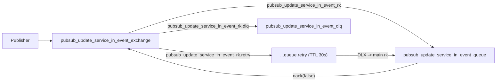
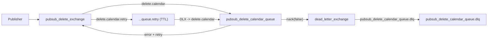

# RabbitMQ - MS Calendar GL

## Estado actual

Consumers que se inicializan al arrancar (`initializePubSubConsumer.ts`):

- `deleteSOFTRecordsConsumer()`
- `deleteSOFTRecordsDLQConsumer()`
- `updateServiceInEventConsumer()`
- `updateServiceInEventDLQConsumer()`

Consumer no activo ahora:

- `recurrenceWorkerConsumer()` (comentado)

## Flujo 1: updateServiceInEvent

Objetivo:

- cuando cambia un servicio en catalogo, actualizar snapshots de eventos futuros que usan ese servicio

Topologia:



Parametros relevantes:

- `PREFETCH = 5`
- `MAX_RETRIES = 5`
- `RETRY_DELAY_MS = 30000`
- DLQ con TTL 24h y max 1000 mensajes

Contrato de payload (actual):

```json
{
  "payload": {
    "id": "service-id",
    "name": "Nuevo nombre",
    "price": 35,
    "discount": 0,
    "duration": 45,
    "sendNotification": true
  }
}
```

Notas:

- `payload.id` es obligatorio de facto (si falta, el mensaje se manda a DLQ)
- se actualizan solo eventos con `endDate > now` y `deletedDate = null`
- si `sendNotification = true`, se notifica por `idGroup` afectado

## Flujo 2: deleteSOFTRecords

Objetivo:

- ejecutar borrados por dominio ante eventos de vida de empresa/workspace/usuarios/clientes

Topologia:



Parametros relevantes:

- `MAX_RETRIES = 3`
- `RETRY_DELAY_MS = 30000`
- TTL cola principal por defecto: 3 dias
- TTL DLQ por defecto: 7 dias

Tablas/escenarios soportados en el consumer:

- `companies`
- `workspaces`
- `userWorkspaces-byWorkspace`
- `userWorkspaces-byWorkspace-hard`
- `userWorkspaces-byUser`
- `clientWorkspaces`
- `clients`
- `users`
- `usersEventDeleteDefinitive`

Comportamiento:

- mezcla de soft delete y hard delete segun `table`
- procesamiento en chunks para evitar transacciones gigantes
- mensajes muy grandes se reparten en sub-mensajes (`MAX_IDS_PER_MSG`)

## DLQ (estado real)

- ambos flujos (`deleteSOFTRecords` y `updateServiceInEvent`) tienen consumer DLQ dedicado
- los mensajes muertos se persisten en DB en `deadLetterMessages`
- existe replay manual hacia cola principal mediante feature `dead-letter-management`
- no hay replay automatico (es intencional por control operativo)

Endpoints de operacion:

- `GET /api/ops/dlq/messages`
- `POST /api/ops/dlq/messages/:id/replay`

Restriccion:

- solo `ROLE_SUPER_ADMIN` y `ROLE_DEVELOPER`

## Idempotencia en consumers

En los dos consumers principales se aplica estrategia Redis `messageReliability`:

- lock temporal por mensaje (evita doble procesamiento en paralelo)
- marca de procesado con TTL (evita reprocesado duplicado)

## Pruebas de integracion reales (Rabbit + Redis + Postgres)

Existe suite dedicada para validar el circuito completo en local sin depender de otros MS:

- test: `tests/integration/rabbitmq/update-service-in-event.rabbitmq.integration.test.ts`
- entorno: `docker-compose.integration.yml`
- variables: `tests/integration/env/rabbitmq.integration.env`

Comandos:

```bash
npm run it:rabbitmq:up
npm run it:rabbitmq:migrate
npm run test:integration:rabbitmq
npm run it:rabbitmq:down
```

Nota operativa:

- para `test:integration:rabbitmq` no hace falta `npm run start`; los consumers se inicializan dentro del test.

Cobertura actual de esa suite:

- `happy path`: actualiza eventos futuros con `updateServiceInEvent`
- `DLQ path`: payload invalido termina en `deadLetterMessages`

## Publicadores relevantes en este MS

- `sendUpdateServiceInEvent(...)`
- `publishDeleteRecordsMessage(...)`
- `publishStoreNotification*` (store notification exchange)

## Deuda técnica

Para este MVP se priorizó cerrar bien los flujos críticos antes que montar toda la capa operativa.

Trade-off real ahora mismo:

- hay replay manual, pero no replay automático con scheduler
- guardamos DLQ en BD, pero todavía no hay alertas activas ni dashboard operativo
- aún conviven contratos históricos con nuevos y conviene terminar de versionarlos
- `deleteSOFTRecords` tiene mucha lógica en un solo consumer; a medio plazo conviene partirlo por dominios/casos

## Recomendacion minima cuando toque endurecer

1. alertas por umbral de DLQ (> N mensajes / 5 min)
2. politica de archivado/purga de `deadLetterMessages`
3. dashboard operativo de replay (exito/fallo y ultimo error)
4. documentar version de payload por mensaje (`v: 1`, `v: 2`, ...)
