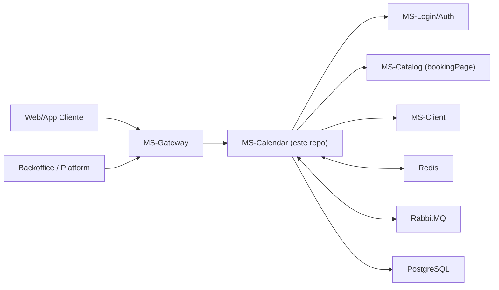

# System Context - MS Calendar GL

## Objetivo del MS

`ms-calendar-gl` centraliza la logica de agenda y reservas:

- disponibilidad (business hours, worker hours, excepciones)
- creacion/edicion/cancelacion de bookings
- reglas de asignacion de profesionales
- sincronizacion de cambios de catalogo hacia eventos futuros

## Mapa de contexto (alto nivel)

## Dependencias directas que si importan aqui

### 1) MS-Login/Auth

Uso real en este MS:

- validar JWT (claims de `idUser`, `idCompanySelected`, `role`)
- resolver snapshots de usuarios y workspaces via gateway

Endpoints internos consumidos:

- `POST /auth/api/ms/internal/users/_batch`
- `POST /auth/api/ms/internal/workspaces/_batch`

Motivo funcional:

- comprobar contexto de usuario/empresa/rol para operaciones protegidas
- resolver timezone/config de workspace para calcular disponibilidad y reglas

### 2) MS-Catalog (en codigo, `bookingPage`)

Uso real en este MS:

- resolver servicios por id
- resolver servicios asignables a usuarios (`userServices`)
- resolver catalogo por company/workspace

Endpoints internos consumidos:

- `POST /bookingPage/api/ms/internal/services/_batch`
- `POST /bookingPage/api/ms/internal/services/users/_batch`
- `GET /bookingPage/api/ms/categories/company/:idCompany/workspace/:idWorkspace`

Motivo funcional:

- validar que el servicio existe y pertenece al workspace
- validar quien puede ejecutar cada servicio antes de asignar citas
- mantener snapshots (precio, duracion, descuento) en el evento

### 3) MS-Client

Uso real en este MS:

- resolver y/o crear `clientWorkspace` durante flujo de booking de cliente

Endpoints internos consumidos:

- `POST /client/api/ms/internal/client-workspaces/_batch`
- `POST /client/api/ms/internal/client-workspaces/clientIds/_batch`
- `POST /client/api/ms/internal/client-workspaces/create-from-microservices`

Motivo funcional:

- garantizar que el cliente esta asociado al workspace/compania antes de reservar

## Regla de documentacion recomendada

Pregunta: "hablamos de todos los MS aunque no toquen este?"

Respuesta recomendada:

- si: listar todos a alto nivel en un diagrama de contexto
- no: no entrar al detalle tecnico de los que no interactuan con `ms-calendar-gl`
- detalle profundo solo para dependencias directas (Auth, Catalog, Client, Gateway, Rabbit, Redis, DB)

## Tipo de mapa que te recomiendo hacer

### A) C4 - Context (este documento)

- 1 caja por sistema/microservicio
- flechas con "quien llama a quien" y "para que"

### B) C4 - Container (siguiente paso)

Dentro de este MS:

- API REST
- capa de negocio (`features/*`)
- persistencia (`prisma`)
- integraciones (`@service-token-client`, Rabbit, Redis)

### C) 2 secuencias clave (muy utiles)

1. "Crear reserva desde cliente"
2. "Actualizar servicio en catalogo -> actualizar eventos futuros"

## Que informacion te pediria para cerrar un mapa profesional

- lista oficial de MS y ownership
- para cada relacion: contrato, timeout, retry, fallback
- eventos Rabbit por dominio (publisher/consumer)
- SLO/SLA por flujo critico (booking create/update/cancel)

Con eso se puede cerrar un mapa versionable y util para onboarding.
